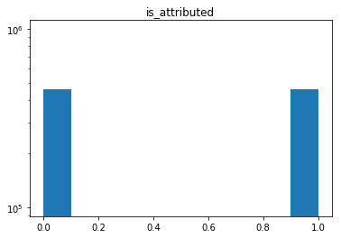
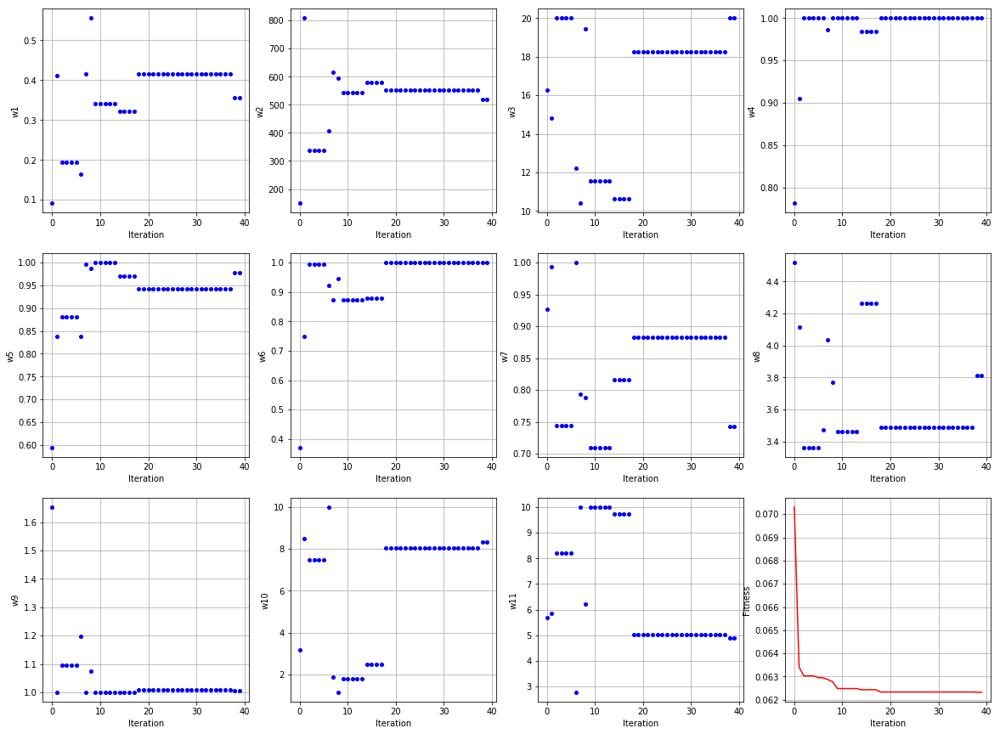

<p align="center">
  
</p>

# XGBoost Hyperparameters Tuning using Differential Evolution Algorithm 


In this project, the metaheuristic algorithm is used for tuning machine learning algorithms hyper-parameters. 
A fraud detection project from the Kaggle challenge is used as a base project. 
The Project composed of three distinct sections.
* **Metahurestic Algorithm (MA):** Differential Evolution Algorithm (DEA) selected as an intelligent searching tool. The DE Algorithm is work on top of the ML Algorithm (in this case XGBoost) to find the best set of hyper-parameters.
* **Machine Learning Algorithm:** The XGBoost which is a powerful machine learning algorithm is selected and the DEA is applied to find the best set of hyper-paratmers.
* **Final step:** The Tuned ML algorithm is applied to the Fraud detection challange (training, validation, and test). The results was promising and showed 89% accuracy on test data.

In this notebook, we apply the Intelligent search methods like Differential Evolution Algorithm to find the best ML algorithm hyper-parameters. Previous options are using either predetermined or randomly generated parameters for the ML algorithms. Some of these searching methods are actually a simulation of Intelligent agents in nature like the folk of birds or school of fishes.


### Project Structure
---
```
XGBoost_Hyperparameters_Tuning 

|__ code/
|   |__ xgboost-hyperparameters-and-ai.ipynb
|__ datasets/
|__ assets/
|__ figures/
|__ README.md
```


### Searching Algorithm of your choice
---
In this project the DE algorithm is selected as a intelligent searching tool. You may use your favorite one and replace it into the provided notebook in this project. 
The DE algorithm code borrowed from [this work](https://pablormier.github.io/2017/09/05/a-tutorial-on-differential-evolution-with-python/#). 
*We change these codes in another project [here](https://github.com/Atashnezhad/DE_algorithm_multi_objective_function) and make them to takes several objective functions simultaneously which would be more applicable to broad range of problems.*
The DE algorithm is a branch of evolutionary methods developed by [Storn and Price (1997)](https://link.springer.com/article/10.1023/A:1008202821328)
and it is used to find the optimum solution for extensive, continuous domains. The DE algorithm begins with a population of random
candidates and it recombines them to improve the fitness of each one iteratively using a simple equation.

Each random pair vectors (X1,X2) give a differential vector (X3 = X2 – X1). The weighted difference vector, X4
= F × X3, is used to perturb the third random vector, X5 using Eqation (X6 = X5 + X4) to achieve the noisy random vector, X6.
The "F" term is called weighting or scaling factor and it is primarily within the range of 0.5 to 2. The
weighting factor determines the amplification of differential variation among candidates. A crossover (CR)
factor regulates the amount of recombinations between candidates. The CR is applied to the noisy random
vector by taking the target vector into account to achieve the trial vector. The fitness of the trial vector is then
compared to the target vector and it is replaced if it is a better fit. The DE algorithm repeats the mutation
(weighting factor), recombination (crossover factor) and selection steps until a predetermined criteria is
achieved.
The four major steps for evolutionary methods are provided at the following figure. The DE algorithm, like any
other metaheuristic algorithm, doesn't guarantee that an optimal solution is ever found ([Atashnezhad et al., 2017](https://www.onepetro.org/conference-paper/SPE-185741-MS)).

<p align="center">
  
</p>


### ML algorithm of your choice
---
Let's use the most Common ML Competition algorithm XGBoost for this project. You may choose a different one and replace it into the codes. 


### Data-set of your choice
---
Let's use the TalkingData set which is available [here](https://www.kaggle.com/c/talkingdata-adtracking-fraud-detection/data) on Kaggle.
```
Fraud challenge data set

|__ data/
|   |__ ip
|   |__ app
|   |__ device
|   |__ os
|   |__ click_time
|   |__ attributed_time
|   |__ is_attributed
```


### Some handy functions
---
Several functions were defined at the begining of the project which help in writing codes more efficient. An example is provided at the following.

```python
def read_train_test_data_balanced(address_train):
    
    #Read Training data, all class 1 and add same amount 0
    iter_csv = pd.read_csv(address_train, iterator=True, chunksize=10000000, parse_dates=['click_time'])
    df_train_1 = pd.concat([chunk[chunk['is_attributed'] > 0] for chunk in iter_csv])
    iter_csv = pd.read_csv(address_train, iterator=True, chunksize=10000000, parse_dates=['click_time'], skiprows = range(1,120000000), nrows=2000000)
    df_train_0 = pd.concat([chunk[chunk['is_attributed'] == 0] for chunk in iter_csv])
    #seperate same number values as train data with class 1
    df_train_0 = df_train_0.head(len(df_train_1))
    #Merge 0 and 1 data
    df_train = Merge_data(df_train_1, df_train_0)
    return df_train
```

Usiing above function read all 1 values from the train data set and then add the same number of 0 and keep it. 

```python
df_train = read_train_test_data_balanced(address_train)
df_train.head(3)
```
Now we do have a balance data set with an equal number of 0 and 1.
<div style="text-align:center"></div>

### Run DE Algorithm to find the best XGBoost Algorithm hyper-parameters 
---
```python
#Run the DE algorithm on objective function in your favorite range of hyperparameters.
result = list(De_Algorithm(Objective_Function2,
                 [(0.001,1),   #  eta
                  (3,1500),   #  max_leaves
                  (0,20),   #  max_depth
                  (0,1),   #  subsample
                  (0.001,1),   #  colsample_bytree
                  (0.001,1),   #  colsample_bylevel
                  (0.001,1),   #  min_child_weight
                  (2,8),   #  alpha
                  (1,10),   # scale_pos_weight
                  (1,10),     # nthread
                  (1,10)], #  random_state
                  mut=0.4, crossp=0.8, popsize=10, its=40))
```

The best hyper XGBoost Algorithm hyper-parameters found as the follow:
```
eta                    0.355402
max_leaves           520.000000
max_depth             20.000000
subsample              1.000000
colsample_bytree       0.978686
colsample_bylevel      1.000000
min_child_weight       1.000000
alpha                  4.000000
scale_pos_weight       1.000000
nthread                8.000000
random_state           5.000000
Name: 39, dtype: float64
```

### Visualization of searching progress
---

<div style="text-align:center"></div>


### Train XGBoost using best hyperparamters
---
```python
[0]	train-auc:0.969407	valid-auc:0.968665
Multiple eval metrics have been passed: 'valid-auc' will be used for early stopping.

Will train until valid-auc hasn't improved in 25 rounds.
[5]	train-auc:0.975196	valid-auc:0.97457
[10]	train-auc:0.976906	valid-auc:0.975752
[15]	train-auc:0.977917	valid-auc:0.97621
[20]	train-auc:0.978799	valid-auc:0.976472
[25]	train-auc:0.979276	valid-auc:0.976656
[30]	train-auc:0.979782	valid-auc:0.976689
[35]	train-auc:0.980202	valid-auc:0.97673
[40]	train-auc:0.980494	valid-auc:0.976759
[45]	train-auc:0.98077	valid-auc:0.976747
[50]	train-auc:0.981003	valid-auc:0.976796
[55]	train-auc:0.981273	valid-auc:0.97675
[60]	train-auc:0.98154	valid-auc:0.976738
[65]	train-auc:0.981777	valid-auc:0.97674
[70]	train-auc:0.981938	valid-auc:0.976712
Stopping. Best iteration:
[49]	train-auc:0.980968	valid-auc:0.976798

```

### Test results distribution 
---
<div style="text-align:center"></div>

The model accuracy on test data was found 89%.


[Gif reference](https://giphy.com/gifs/c4d-human-ai-8hYQgBIIHkCPjRTmai).
